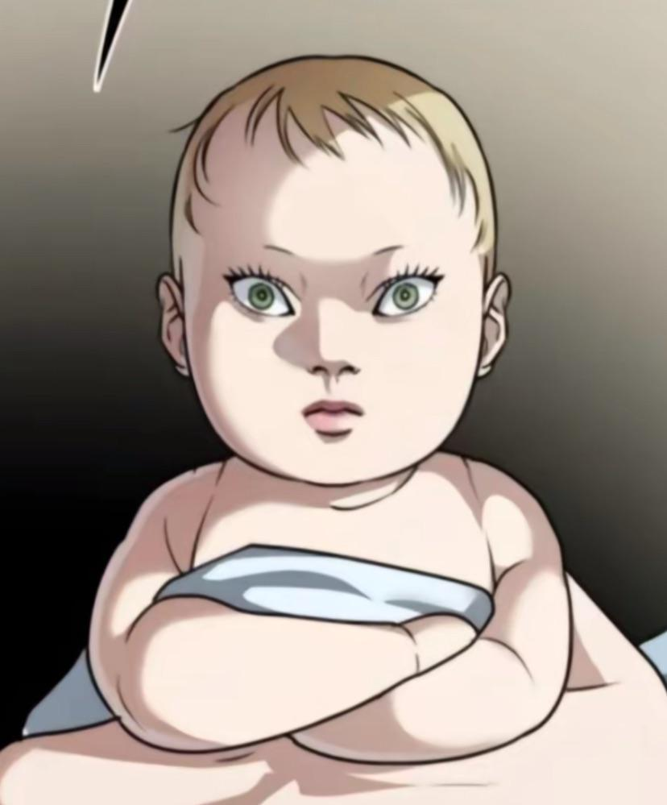

# Landing Page no CSS

<p>Para começar a criar a landing page so site, ou seja, a página principal, comeceu limpando as estilizações implementadas por padrão pelos navegadores:</p>

```css
/*

███████  ███████ ███████ ███████ ██████████
██    ██ ██      ██      ██          ██
███████  █████   ███████ █████       ██
██    ██ ██           ██ ██          ██
██    ██ ███████ ███████ ███████     ██

*/
body 
{
    margin: 0;
    padding: 0;
    overflow-x: hidden;
}
```

<p>Logo após ter a página limpa para eu poder trabalhar, criar o topo da página, ou seja, de acordo com o protótipo do Figma, a barra de menu:</p>

```css
/* 

███    ███ ███████ ███    ██ ██    ██
████  ████ ██      ████   ██ ██    ██
██ ████ ██ █████   ██ ██  ██ ██    ██
██  ██  ██ ██      ██  ██ ██ ██    ██
██      ██ ███████ ██   ████  ██████

*/
/*Configuração da barra de menu*/
.barra-cima
{
    background-color: rgb(0, 132, 255);
    padding: 15px 0;
    display: flex;
    justify-content: center;
    width: 100%;
    box-shadow: 0 2px 5px rgba(0,0,0,0.1);
    position: relative;
}

/*Ajuste dos conteúdos dentro da barra de menu*/
.barra-conteudo
{
    width: 100%;
    display: flex;
    justify-content: space-between;
    align-items: center;
    padding: 0 20px;
}

/*Placeholder enquanto a logo ainda não é adicionada*/
.logo
{
    cursor: pointer;
    margin-right: auto;
    font-weight: bold;
    font-size: 1.5rem;
}

/*Indicador de que as opçãos no menu (textos e botões) são clicáveis*/
.opcoes-menu
{
    cursor: pointer;
    margin-right: auto;
}
```
<p align="center"></p>

<p>Com a criação da barra de menu, surgiu-se meu primeiro problema: os botões. Queria botões personalizados, porém, que houvesse uma distinção entre aqueles presentes dentro da barra de menu e aqueles presentes no corpo, bacisamente por conta do espaço com que estava trabalhando.</p>

```css
/*

███████   ██████  ██████████  ██████  ███████ ███████
██    ██ ██    ██     ██     ██    ██ ██      ██
███████  ██    ██     ██     ██    ██ █████   ███████
██    ██ ██    ██     ██     ██    ██ ██           ██
███████   ██████      ██      ██████  ███████ ███████

*/
/*Estilização dos botões + animação de quando o mouse passa por cima*/
.botao-primario 
{
    cursor: pointer;
    background-color: rgb(247, 47, 47);
    color: white;
    border: none;
    border-radius: 8px;
    padding: 12px 24px;
    min-width: 160px;
    font-family: 'Architects Daughter', sans-serif;
    font-size: 1.1rem;
    text-align: center;
    transition: all 0.3s ease;
    display: inline-block;
    margin: 10px 0;
}

/*Configuração dos botões na barra de menu*/
.botao-primario.menu 
{
    margin: 0 5px;
    padding: 10px 20px;
}

/*Configuração dos botões presentes dentro do corpo do HTML*/
.botao-primario.conteudo 
{
    margin: 30px auto;
    display: block;
    width: fit-content;
}

/*Animações quando o mouse passa por cima do botão:*/
.botao-primario:hover 
{
    background-color: rgb(200, 40, 40);
    transform: scale(1.02);
    box-shadow: 0 4px 8px rgba(0, 0, 0, 0.2);
}

.botao-primario:active 
{
    transform: scale(0.98);
}

.botao-primario:focus 
{
    outline: 2px solid #0084ff;
    outline-offset: 2px;
}

.botao-conteudo:hover 
{
    background-color: rgb(200, 40, 40);
}

.botao:hover 
{
    background-color: rgb(200, 40, 40);
}
```
<p>Botão comum:</p>
<p align="center"></p>
<p>Botão Selecionado:</p>
<p align="center"></p>

<p>Logo após fazer os botões, fiz o título, vulgo "o nome do petshop":</p>

```css
/*

███████   ██████  ███████  ███████ ███████  ██████  ██      ██    ██  ██████
██       ██    ██ ██    ██ ██      ██      ██    ██ ██      ██    ██ ██    ██
██       ████████ ███████  █████   ██      ████████ ██      ████████ ██    ██
██       ██    ██ ██    ██ ██      ███████ ██    ██ ██      ██    ██ ██    ██
███████  ██    ██ ███████  ███████    ██   ██    ██ ███████ ██    ██  ██████

*/
.nome-petshop 
{
    text-align: center;
    font-size: 600%;
}

.titulo 
{
    display: block;
    width: fit-content;
    margin: 50px auto 0;
    padding: 0 20px;
    text-align: center;
}
```
<p align="center"></p>

<p>Com os botões selecionados, comecei a trabalhar com a primeira seção, a "Saiba Mais". Como foi a primeira a ser trabalhada, foi a que eu mais tive problemas, principalmente em encaixar o texto e a imagem no lugar certo. Mas no fim, esse fo o resultado:</p>

```css
/*

███████  ██████  ██ ███████   ██████      ███    ███  ██████  ██ ███████
██      ██    ██ ██ ██    ██ ██    ██     ████  ████ ██    ██ ██ ██
███████ ████████ ██ ███████  ████████     ██ ████ ██ ████████ ██ ███████
     ██ ██    ██ ██ ██    ██ ██    ██     ██  ██  ██ ██    ██ ██      ██
███████ ██    ██ ██ ███████  ██    ██     ██      ██ ██    ██ ██ ███████

*/
/*Configuração do espaço onde ficarão os conteúrdos*/
.saiba-mais-conteudo 
{
    display: flex;
    width: 100%;
}

/*Configuração da imagem*/
#saiba-mais-imagem 
{
    margin-left: 120px;
    margin-right: 10px;
    margin-top: 50px;
    max-width: 50%;
}

/*Configuração do texto*/
#saiba-mais-descricao {
    max-width: 50%;
    margin-top: 100px;
    margin-left: 100px;
    font-size: 150%;
    background-color: rgba(0, 132, 255, 0.1);
    border-radius: 8px;
    border-left: 4px solid rgb(0, 132, 255);
    padding: 30px; /* Espaçamento interno generoso */
    line-height: 1.6; /* Altura de linha melhorada */
    text-align: justify; /* Texto alinhado */
}
```

<p align="center"></p>
<p align="center">(A imagem presente é apenas um placeholder de onde ficará a imagem definitiva.)</p>

<p>Finalizando a primeira seção, parti para a segunda: "Adote um pet". Com base no protótipo feito no figma, essa é a parte que mais se diferenciou. Decifi fazer um sistema de "carrossel", ou seja, onde as imagens ficariam passando da direita para a esquerda em looping e, assim que o mous passar por cima de alguma imagem, ela aumentará de tamanho e o carrossel irá parar.</p>

```css
/*

 ██████  ███████   ██████  ██████████ ███████
██    ██ ██    ██ ██    ██     ██     ██
████████ ██    ██ ██    ██     ██     █████
██    ██ ██    ██ ██    ██     ██     ██
██    ██ ███████   ██████      ██     ███████

*/
/*Configuração do espaço para o carrossel*/
.carrossel-container 
{
    width: 100%;
    position: relative;
}

/*Configuração do carrossel*/
.adote-conteudo.carrossel 
{
    display: flex;
    width: max-content;
    animation: scroll 40s linear infinite;
}


@keyframes scroll 
{
    0% { transform: translateX(0); }

    100% { transform: translateX(calc(-50% - 15px)); }
}

/*Configuração das imagens que serão apresentadas no carrosel*/
.carrossel-img 
{
    width: 280px;
    height: 200px;
    object-fit: cover;
    border-radius: 12px;
    margin-right: 30px;
    transition: transform 0.3s;
    margin-top: 15px;
}

/*Indicando que quando o mouse passar por alguma imagem, a mesma aumentará levemente seu tamanho*/
.carrossel-img:hover 
{
    transform: scale(1.10);
    z-index: 1;
}

/*Indicando que a animação de carrossel deve parar quando o mouse estiver encima de alguma imagem*/
.adote-conteudo.carrossel:hover 
{
    animation-play-state: paused;
}
```
<p>Carrossel:</p>
<p algin="center"></p>
<p align="center">(As imagnes presentes são apenas um placeholders de onde ficarão as imagens definitivas.)</p>
<p>Imagem selecionada no Carrossel:</p>
<p algin="center"></p>
<p align="center">(As imagnes presentes são apenas um placeholders de onde ficarão as imagens definitivas.)</p>

<p>Diferentemente da seção "Adote um Pet", a seção de agendamento ficou um tanto quanto parecida com o protótio no Figma. Apenas algumas imagens mostrando serviçoes (que mais tarde serão trocadas)</p>

```css
/*

██    ██  ██████  ███████   ██████  ███████  ██  ██████
██    ██ ██    ██ ██    ██ ██    ██ ██    ██ ██ ██    ██
████████ ██    ██ ███████  ████████ ███████  ██ ██    ██
██    ██ ██    ██ ██    ██ ██    ██ ██    ██ ██ ██    ██
██    ██  ██████  ██    ██ ██    ██ ██    ██ ██  ██████

*/
/*Configuração do espaço que será trabalhado*/
.agende-horario-conteudo 
{
    display: grid;
    grid-template-columns: repeat(4, 1fr);
    gap: 15px;
    align-items: center;
    padding: 0 15px;
}

/*Configuração das imagens*/
.agende-img 
{
    width: 100%;
    height: 200px;
    object-fit: cover;
    border-radius: 8px;
    display: block;
    transition: transform 0.3s ease;
    margin-top: 25px;
    cursor: pointer;
}

/*Animação para imagem aumentar de tamanho quando o mouse passar por cima*/
.agende-img:hover 
{
    transform: scale(1.05);
}

.agendar-horario-descricao {
    grid-column: 1 / -1; /* Ocupa todas as colunas */
    margin-top: 20px;
    padding: 15px;
    font-size: 1.2rem;
    line-height: 1.6;
    text-align: center;
    background-color: rgba(0, 132, 255, 0.1); /* Fundo azul claro */
    border-radius: 8px;
    border-left: 4px solid rgb(0, 132, 255); /* Borda lateral decorativa */
}
```
<p>Imagens comuns</p>
<p align="center"></p>
<p align="center">(As imagnes presentes são apenas um placeholders de onde ficarão as imagens definitivas.)</p>
<p>Imagem seleconada:</p>
<p align="center"></p>
<p align="center">(As imagnes presentes são apenas um placeholders de onde ficarão as imagens definitivas.)</p>

<p>Entretanto, das páginas mencionadas no protótipo no Figma, decidi tirar a página de "Lojas Parceiras", pelo menos da página inicial (visto que não tirei da barra de menu). Caso eu tenha tempo, adicionarei uma página HTML para ela, caso contrário tirarei da barra de menu. A próxima atualização será a implementação do JavaScrit juntamente da criação das páginas de Login e Sign-In.</p>

## Código em CSS:

```css
/*

███████  ███████ ███████ ███████ ██████████
██    ██ ██      ██      ██          ██
███████  █████   ███████ █████       ██
██    ██ ██           ██ ██          ██
██    ██ ███████ ███████ ███████     ██

*/
body 
{
    margin: 0;
    padding: 0;
    overflow-x: hidden;
}


/* 

███    ███ ███████ ███    ██ ██    ██
████  ████ ██      ████   ██ ██    ██
██ ████ ██ █████   ██ ██  ██ ██    ██
██  ██  ██ ██      ██  ██ ██ ██    ██
██      ██ ███████ ██   ████  ██████

*/
/*Configuração da barra de menu*/
.barra-cima
{
    background-color: rgb(0, 132, 255);
    padding: 15px 0;
    display: flex;
    justify-content: center;
    width: 100%;
    box-shadow: 0 2px 5px rgba(0,0,0,0.1);
    position: relative;
}

/*Ajuste dos conteúdos dentro da barra de menu*/
.barra-conteudo
{
    width: 100%;
    display: flex;
    justify-content: space-between;
    align-items: center;
    padding: 0 20px;
}

/*Placeholder enquanto a logo ainda não é adicionada*/
.logo
{
    cursor: pointer;
    margin-right: auto;
    font-weight: bold;
    font-size: 1.5rem;
}

/*Indicador de que as opçãos no menu (textos e botões) são clicáveis*/
.opcoes-menu
{
    cursor: pointer;
    margin-right: auto;
}


/*

███████   ██████  ██████████  ██████  ███████ ███████
██    ██ ██    ██     ██     ██    ██ ██      ██
███████  ██    ██     ██     ██    ██ █████   ███████
██    ██ ██    ██     ██     ██    ██ ██           ██
███████   ██████      ██      ██████  ███████ ███████

*/
/*Estilização dos botões + animação de quando o mouse passa por cima*/
.botao-primario 
{
    cursor: pointer;
    background-color: rgb(247, 47, 47);
    color: white;
    border: none;
    border-radius: 8px;
    padding: 12px 24px;
    min-width: 160px;
    font-family: 'Architects Daughter', sans-serif;
    font-size: 1.1rem;
    text-align: center;
    transition: all 0.3s ease;
    display: inline-block;
    margin: 10px 0;
}

/*Configuração dos botões na barra de menu*/
.botao-primario.menu 
{
    margin: 0 5px;
    padding: 10px 20px;
}

/*Configuração dos botões presentes dentro do corpo do HTML*/
.botao-primario.conteudo 
{
    margin: 30px auto;
    display: block;
    width: fit-content;
}

/*Animações quando o mouse passa por cima do botão:*/
.botao-primario:hover 
{
    background-color: rgb(200, 40, 40);
    transform: scale(1.02);
    box-shadow: 0 4px 8px rgba(0, 0, 0, 0.2);
}

.botao-primario:active 
{
    transform: scale(0.98);
}

.botao-primario:focus 
{
    outline: 2px solid #0084ff;
    outline-offset: 2px;
}

.botao-conteudo:hover 
{
    background-color: rgb(200, 40, 40);
}

.botao:hover 
{
    background-color: rgb(200, 40, 40);
}


/*

███████   ██████  ███████  ███████ ███████  ██████  ██      ██    ██  ██████
██       ██    ██ ██    ██ ██      ██      ██    ██ ██      ██    ██ ██    ██
██       ████████ ███████  █████   ██      ████████ ██      ████████ ██    ██
██       ██    ██ ██    ██ ██      ███████ ██    ██ ██      ██    ██ ██    ██
███████  ██    ██ ███████  ███████    ██   ██    ██ ███████ ██    ██  ██████

*/
.nome-petshop 
{
    text-align: center;
    font-size: 600%;
}

.titulo 
{
    display: block;
    width: fit-content;
    margin: 50px auto 0;
    padding: 0 20px;
    text-align: center;
}


/*

███████  ██████  ██ ███████   ██████      ███    ███  ██████  ██ ███████
██      ██    ██ ██ ██    ██ ██    ██     ████  ████ ██    ██ ██ ██
███████ ████████ ██ ███████  ████████     ██ ████ ██ ████████ ██ ███████
     ██ ██    ██ ██ ██    ██ ██    ██     ██  ██  ██ ██    ██ ██      ██
███████ ██    ██ ██ ███████  ██    ██     ██      ██ ██    ██ ██ ███████

*/
/*Configuração do espaço onde ficarão os conteúrdos*/
.saiba-mais-conteudo 
{
    display: flex;
    width: 100%;
}

/*Configuração da imagem*/
#saiba-mais-imagem 
{
    margin-left: 120px;
    margin-right: 10px;
    margin-top: 50px;
    max-width: 50%;
}

/*Configuração do texto*/
#saiba-mais-descricao {
    max-width: 50%;
    margin-top: 100px;
    margin-left: 100px;
    font-size: 150%;
    background-color: rgba(0, 132, 255, 0.1);
    border-radius: 8px;
    border-left: 4px solid rgb(0, 132, 255);
    padding: 30px; /* Espaçamento interno generoso */
    line-height: 1.6; /* Altura de linha melhorada */
    text-align: justify; /* Texto alinhado */
}


/*

 ██████  ███████   ██████  ██████████ ███████
██    ██ ██    ██ ██    ██     ██     ██
████████ ██    ██ ██    ██     ██     █████
██    ██ ██    ██ ██    ██     ██     ██
██    ██ ███████   ██████      ██     ███████

*/
/*Configuração do espaço para o carrossel*/
.carrossel-container 
{
    width: 100%;
    position: relative;
}

/*Configuração do carrossel*/
.adote-conteudo.carrossel 
{
    display: flex;
    width: max-content;
    animation: scroll 40s linear infinite;
}


@keyframes scroll 
{
    0% { transform: translateX(0); }

    100% { transform: translateX(calc(-50% - 15px)); }
}

/*Configuração das imagens que serão apresentadas no carrosel*/
.carrossel-img 
{
    width: 280px;
    height: 200px;
    object-fit: cover;
    border-radius: 12px;
    margin-right: 30px;
    transition: transform 0.3s;
    margin-top: 15px;
}

/*Indicando que quando o mouse passar por alguma imagem, a mesma aumentará levemente seu tamanho*/
.carrossel-img:hover 
{
    transform: scale(1.10);
    z-index: 1;
}

/*Indicando que a animação de carrossel deve parar quando o mouse estiver encima de alguma imagem*/
.adote-conteudo.carrossel:hover 
{
    animation-play-state: paused;
}


/*

██    ██  ██████  ███████   ██████  ███████  ██  ██████
██    ██ ██    ██ ██    ██ ██    ██ ██    ██ ██ ██    ██
████████ ██    ██ ███████  ████████ ███████  ██ ██    ██
██    ██ ██    ██ ██    ██ ██    ██ ██    ██ ██ ██    ██
██    ██  ██████  ██    ██ ██    ██ ██    ██ ██  ██████

*/
/*Configuração do espaço que será trabalhado*/
.agende-horario-conteudo 
{
    display: grid;
    grid-template-columns: repeat(4, 1fr);
    gap: 15px;
    align-items: center;
    padding: 0 15px;
}

/*Configuração das imagens*/
.agende-img 
{
    width: 100%;
    height: 200px;
    object-fit: cover;
    border-radius: 8px;
    display: block;
    transition: transform 0.3s ease;
    margin-top: 25px;
    cursor: pointer;
}

/*Animação para imagem aumentar de tamanho quando o mouse passar por cima*/
.agende-img:hover 
{
    transform: scale(1.05);
}

.agendar-horario-descricao {
    grid-column: 1 / -1; /* Ocupa todas as colunas */
    margin-top: 20px;
    padding: 15px;
    font-size: 1.2rem;
    line-height: 1.6;
    text-align: center;
    background-color: rgba(0, 132, 255, 0.1); /* Fundo azul claro */
    border-radius: 8px;
    border-left: 4px solid rgb(0, 132, 255); /* Borda lateral decorativa */
}
```

## Código HTML:

```html
<!DOCTYPE html>
<html lang="pt-br">

<head>
    <meta charset="UTF-8">
    <meta name="viewport" content="width=device-width, initial-scale=1.0">
    <link rel="stylesheet" href="styles.css">
    <link href="https://fonts.googleapis.com/css2?family=Architects+Daughter&display=swap" rel="stylesheet">
    <title>Teste de Fullstack</title>
    <style>
        body {
            font-family: 'Architects Daughter', sans-serif;
        }
    </style>
</head>

<body>
    <div class="barra-cima">
        <div class="barra-conteudo">
            <div class="logo">LOGO</div>
            <span class="opcoes-menu">Sobre Nós</span>
            <span class="opcoes-menu">Agende um Horário</span>
            <span class="opcoes-menu">Adote um Pet</span>
            <span class="opcoes-menu">Lojas Parceiras</span>
        </div>
        <!-- Botões -->
        <button class="botao-primario menu">Cadastre-se!</button>
        <button class="botao-primario menu">Contate-nos!</button>
    </div>
    <div class="nome-petshop" style="color: red;">PET</div>
    <div class="nome-petshop" style="color: rgb(85, 190, 255);">XAUBLIN</div>


    <div class="saiba-mais">
        <h2 class="titulo">SAIBA MAIS SOBRE A EMPRESA!</h2>
        <div class="saiba-mais-conteudo">
            <div id="saiba-mais-descricao">Lorem ipsum dolor sit, amet consectetur adipisicing elit. Quas praesentium,
                non quia omnis cum molestias similique ex sequi temporibus autem labore fugit quasi corrupti ut natus
                nulla velit numquam deleniti.Lorem ipsum dolor sit, amet consectetur adipisicing elit. Quas praesentium,
                non quia omnis cum molestias similique ex sequi temporibus autem labore fugit quasi corrupti ut natus
                nulla velit numquam deleniti.Lorem ipsum dolor sit, amet consectetur adipisicing elit. Quas praesentium,
                non quia omnis cum molestias similique ex sequi temporibus autem labore fugit quasi corrupti ut natus
                nulla velit numquam deleniti.Lorem ipsum dolor sit, amet consectetur adipisicing elit. Quas praesentium,
                non quia omnis cum molestias similique ex sequi temporibus autem labore fugit quasi corrupti ut natus
                nulla velit numquam deleniti.Lorem ipsum dolor sit, amet consectetur adipisicing elit. Quas praesentium,
                non quia omnis cum molestias similique ex sequi temporibus autem labore fugit quasi corrupti ut natus
                nulla velit numquam deleniti.</div>
            
        </div>
        <div class="container-botao">
            <button class="botao-primario conteudo">Saiba mais!</button>
        </div>

    </div>


    <div class="adote-pet">
        <h2 class="titulo">PETS PARA ADOÇÃO!</h2>
        <div class="carrossel-container">
            <div class="adote-conteudo carrossel">
                
                
                
                
                
                
                
                
                
                
                
                
                <!-- Duplicando as imagens para efeito contínuo -->
                
                
                
                
                
                
                
                
                
                
                
                
            </div>
        </div>
        <div class="container-botao">
            <button class="botao-primario conteudo">Adote um Pet!</button>
        </div>
    </div>


    <div class="agende-horario">
        <h2 class="titulo">AGENDE UM HORÁRIO!</h2>
        <div class="agende-horario-conteudo">
            
            
            
            
            <div class="agendar-horario-descricao">Lorem, ipsum dolor sit amet consectetur adipisicing elit. Corporis
                obcaecati error ad debitis, accusamus numquam quod tenetur doloremque, quasi facere aut deleniti dolor
                veritatis nihil, quis quos nostrum voluptatum optio! Lorem ipsum dolor sit amet, consectetur adipisicing
                elit. Distinctio sed molestiae necessitatibus voluptate doloribus optio laudantium nostrum adipisci
                dolores perspiciatis ex nulla sequi cupiditate veniam, deserunt asperiores aspernatur non veritatis!
            </div>
        </div>
        <div class="container-botao">
            <button class="botao-primario conteudo">Agende um Horário!</button>
        </div>
    </div>

    <script src="script.js"></script>
</body>

</html>
```
